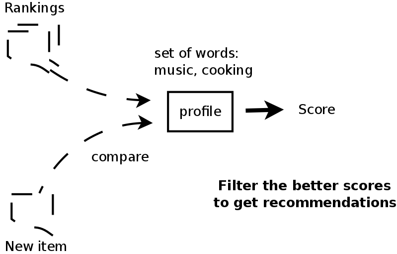
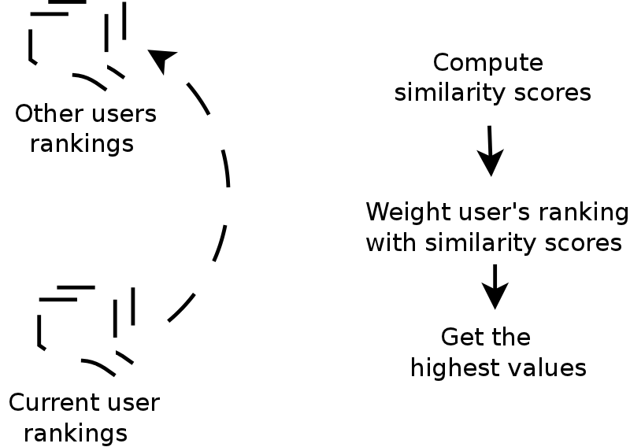

## Different recommendation systems

.fx: bigbullet

* Content-based
* Collaborative Filtering
* Hybrid approach
* All of them have the concept of **users** and **items**.

---

### Content-based

.fx: fullimage

---

### Collaborative filtering

.fx: fullimage

