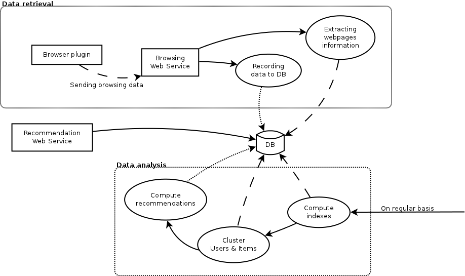

# Design choices

.fx: title

---

## **This** recommendation system

.fx: bigbullet

* Hybrid
* Compares user **profiles** rather than directly users
* Tries to be as unintrusive as possible

---

### Architecture overview

---

## Information retrieval

.fx: bigbullet

* Usage (number of views)
* Content (text content) → removing the useless data
* Navigation flow
* What is the user goal while browsing?
* Location
* Time (day of the week, period of the month, time of the day)

---

## Some statistics

.fx: bigbullet

Since the end of May:

* **25** registered users, **12** sending data regularly
* **95180** events triggered and saved
* **8972** web pages viewed and downloaded by the system
