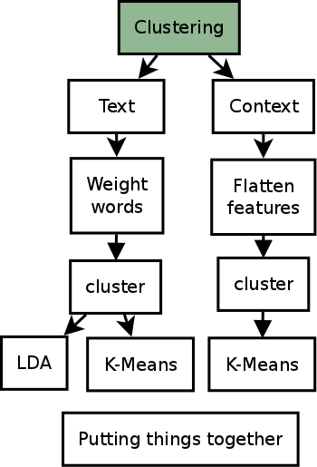
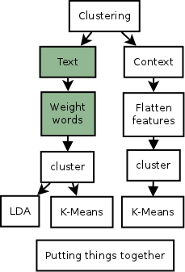
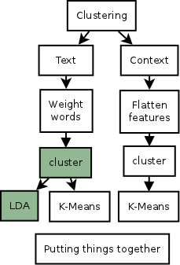
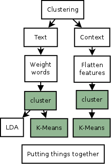
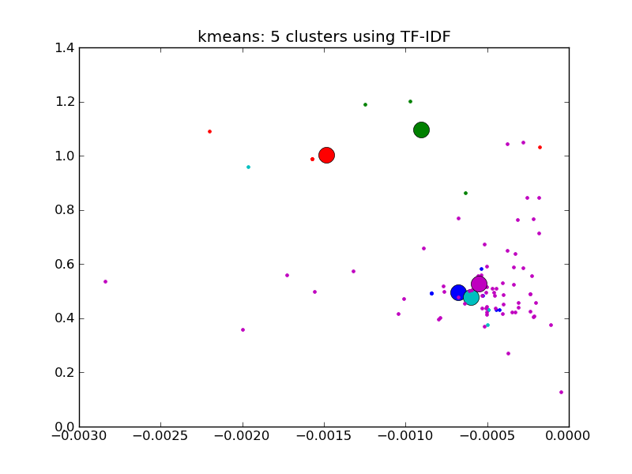
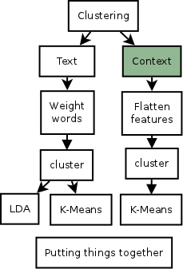
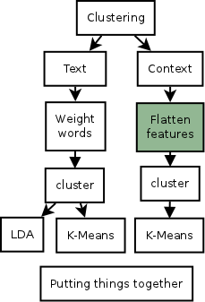
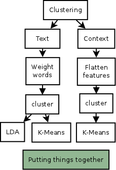

# Clustering data

.fx: title

---

### Profiles

.fx: bigbullet

* Each user is considered to have a number of profiles
* Could be topics, time windows, locations, etc.
* **How do we find them ?**

---

### Overview

.fx: fullimage

---

### TF-IDF, Weighting words

.fx: bigbullet

* **T**erm **F**requency - **I**nverse **D**ocument **F**requency
* Number of occurences of a word:
    * within the document
    * withing the corpus
* Filters the too much used words (e.g "the") and output the **relevant** ones

---

### How do we do

.fx: bigbullet

* Get the vector of words for a sparse-enough matrix (get documents from outside)
* Reducing the Matrix dimensions (PCA)
* Fit the corpus into this transformed vector

---

### Topic extraction (LDA)

.fx: bigbullet

* Latent Dirichlet Allocation (LDA): get a list of topics (words) from a corpus
* **the goal is to classify documents into a set of topics** (this is clustering)

---

### K-Means

.fx: bigbullet

* Choose the number of clusters
* Random centers
* Assign each point to the nearest cluster
* Recompute the centers
* Repeat 3 and 4.

---

## Text clusters

.fx: fullimage

---

### Using the browsing context

.fx: bigbullet

* Each website have a number of visits (you visit a website in different contexts)
* Location
* Time of the day
* Day of the week
* Related tabs

---

### Flattening data

.fx: bigbullet

* Data needs to be flat to feed clustering algorithms
* Total number of views per resource
* Total time spent viewing the resource
* Location: Getting a list of the 100 biggest cities and having a feature for 
  each city representing the distance to it
* For other features, possibility to extract fixed metrics (average, mean,
  median, variance, standard deviation).

---

### Putting it all together

.fx: bigbullet

* Context + Text data → Making a compound data set using vector spaces
* Making both predictions and selecting the better one depending the context
* Combining the predictions
