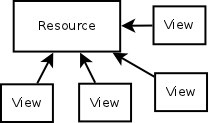

# How to determine profiles / clusters

.fx: title

---

### Possibilities

.fx: bigbullet

* Text based (TF-IDF, Topic extraction)
* Using the **browsing context**

---

### TF-IDF

.fx: bigbullet

* **T**erm **F**requency - **I**nverse **D**ocument **F**requency
* Number of occurences of a word:
    * within the document
    * withing the corpus
* Filters the too much used words (e.g "the") and output the **relevant** ones

---

### Topic extraction

.fx: bigbullet

* Latent Dirichlet Allocation: get a list of topics (words) from a corpus
* Terminology extraction
* **the goal is to classify documents into a set of topics**

---

### Using the browsing context

.fx: bigbullet

* Location
* Time of the day
* Day of the week
* Related tabs

---

### Flattening data

.fx: bigbullet

* Total number of views per resource
* Total time spent viewing the resource
* For other metrics, possibility to extract fix metrics (average, mean,
  median, variance, standard deviation).

---

### Location

.fx: bigbullet

Different approaches:

* Getting a list of the 100 biggest cities and having a feature for 
  each city representing the distance to it
* Trying to group the exact matches

---

### K-Means

.fx: bigbullet

* Choose the number of clusters
* Random centers
* Assign each point to the nearest cluster
* Recompute the centers
* Repeat 3 and 4.

---

## Text clusters

.fx: fullimage

---

### kD-trees

.fx: fullimage

---

### Comparison / Evaluation

.fx: bigbullet

* High similarity within the cluster, Low between clusters
* Manual*
* Memory print
* CPU usage

---

### Putting it all together

.fx: bigbullet

* Different ways to make an hybrid recommender
* Context + Text data → Making a compound data set using vector spaces
* Making both predictions and selecting the better one depending the context
* Combining the predictions
