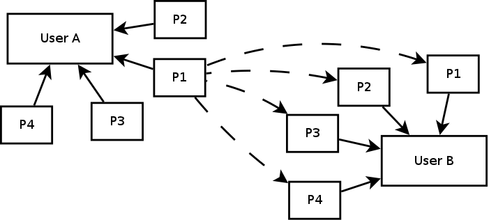

# What's next ?

.fx: title

---

## Ranking views

.fx: bigbullet

* **Know if a user liked a view of a resource**
* Simple heuristics
    * a lot of time spent on the webpage → the user liked it
    * the user came back to see this content → he liked it
* Asking for explicit user feedback
* Asking users some feedback and infer the rest (using supervised learning)

---

## Comparing profiles

.fx: fullimage

---

## A better option

.fx: bigbullet

1. Determine usage windows (timewise and location-wise)
2. Cluster all the users together and find user groups (not profiles)
3. Get the users in the same group and compute the similarity scores between users
4. Get recommendations
